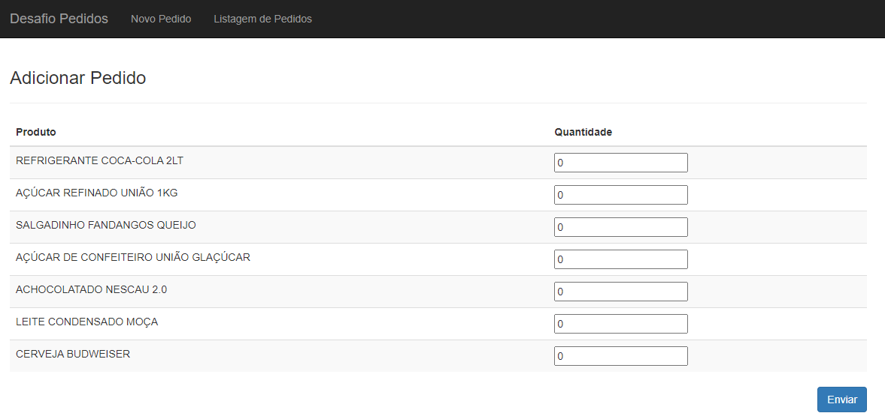
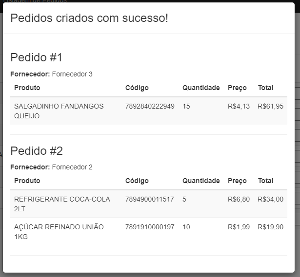
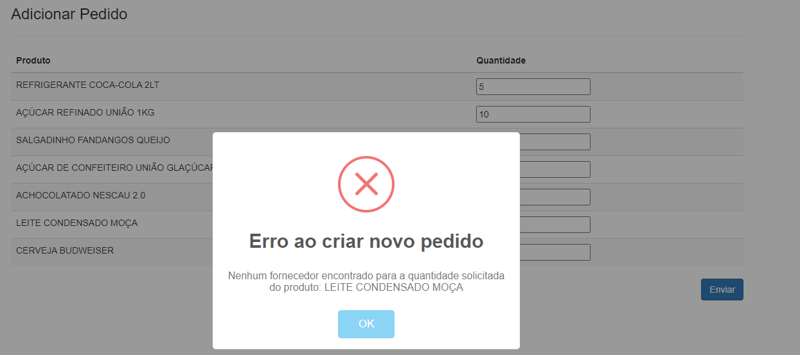

## Requisitos Gerais
- Docker/WSL2 instalado e configurado
- Java 17
- Maven 3+

## Configuração da API Externa de Fornecedores de um Produto
- fazer o clone do projeto: https://github.com/wesleyeduardodev/fornecedores-api
- Entrar na raiz do projeto e executar "mvn clean install" para gerar o target do projeto
- Abrir um terminal na pasta raiz do projeto
- Executar o comando "docker build -t wesleyeduardodev/fornecedores-api:latest ." para gerar imagem da aplicação

## Executar o Projeto API de Pedidos
- Abrir um terminal na pasta raiz do projeto
- Executar comando "mvn clean install" para gerar o target do projeto
- Ainda com o terminal na raiz do projeto, executar o comando "docker compose -f docker-compose-test.yml up -d" (Criar as imagens e subir todos os containers)
- Obs: Caso ocorra problemas ao subir todos os container de forma simultanea basta subir um container de cada vez. (As vezes pode ocorrer problemas onde um container precisa de outro que ainda não subiu totalmente - Isso será resolvido posteriormente usando o recurso "wait-for-it")

## Links para uso da aplicação
- Dados de login para autenticação básica: user: admin e senha: admin
- Criar novos pedidos: http://localhost:8080/#!/pedidos/novo
- Listar Pedidos: http://localhost:8080/#!/pedidos
- Swagger: http://localhost:8080/pedidos-api/swagger-ui.html

## Comandos Docker que podem ser utéis
- Remover todos os containers: docker rm $(docker ps -a -q) -f
- Remover todos as imagens: docker rmi $(docker images -q) -f
- Remover todos os volumes: docker volume rm $(docker volume ls -qf dangling=true)

## Proposta do desafio:

A proposta deste desafio é conhecer suas habilidades de resolver problemas de negócio por meio de programação.
Estamos enviando para você um arquivo zip contendo um projeto de uma aplicação Java Web (Spring Boot, Hibernate e AngularJs) com o Frontend já desenvolvido.

Seu desafio será implementar o Backend e integrar com o Frontend.

## O problema

Você deve desenvolver um sistema para realizar **pedidos** a partir de uma lista de **produtos**, conforme a imagem:



Os produtos **já estão cadastrados** e possuem 2 atributos: GTIN (código de barra) e nome.

Quando o usuário digitar a quantidade de cada produto e clicar no botão Enviar, o sistema deverá chamar a API "URL da API Externa" informando o GTIN de cada produto. O retorno da API será uma lista de **fornecedores** e dentro de cada fornecedor uma lista de **preços** de acordo com a **quantidade mínima** para compra. Não é obrigatório informar a quantidade para todos os produtos.

Veja um exemplo do retorno da API externa para o GTIN 7894900011517:
```json
[
    {
        "nome": "Fornecedor 1",
        "cnpj": "56.918.868/0001-20",
        "precos": [
            {
                "preco": 6.89,
                "quantidade_minima": 1
            },
            {
                "preco": 5.89,
                "quantidade_minima": 10
            }
        ]
    },
    {
        "nome": "Fornecedor 2"
        "cnpj": "37.563.823/0001-35",
        "precos": [
            {
                "preco": 6.8,
                "quantidade_minima": 1
            },
            {
                "preco": 6,
                "quantidade_minima": 10
            }
        ],
    }
]
```

O sistema deve selecionar o melhor fornecedor para compra de cada produto considerando o menor preço que atenda a quantidade mínima de compra. Em seguida, deverá agrupar os produtos de um mesmo fornecedor e criar um pedido para cada um. O resultado será algo semelhante a imagem:



Caso nenhum fornecedor atenda a quantidade mínima de qualquer um dos produtos, o sistema deverá retornar uma mensagem informando o usuário e não deve criar nenhum pedido:



O pedido deve ter um fornecedor e uma lista dos itens comprados. Caso o fornecedor retornado pela API ainda não esteja cadastrado, o sistema deverá incluí-lo para poder vincular com o pedido.

O sistema também deverá possuir uma rota para listar todos os pedidos criados até o momento.
